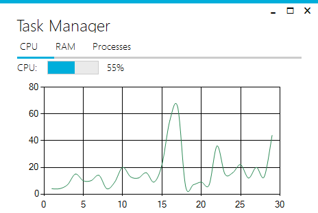
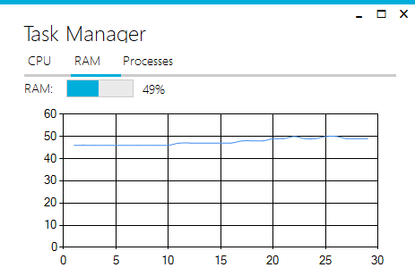
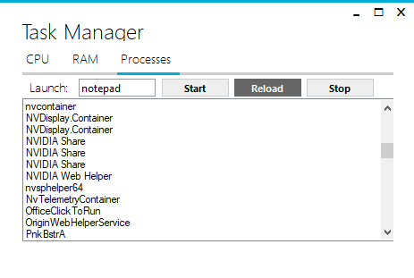

# Task-Manager
A simple desktop application that imitates the task manager. 

## Features
- Display CPU usage as continuous graph
- Display RAM usage as continuous graph
- Process
  - Start a process (i.e. notepad.exe)
  - End a process by clicking on the active process from the list
  
## Screenshots

